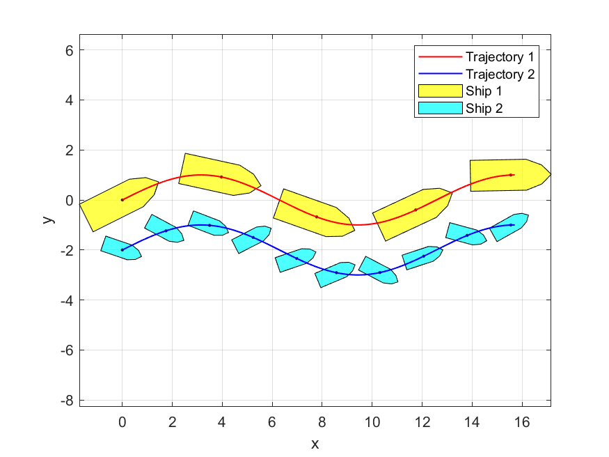

# ship-marker
Draw ship-shaped markers on a curve with Matlab function Plot.

## usage

```matlab
shipmk( x, y, psi, ms, mn, mc );  

``` 

### inputs:

-   `(x, y)` - point set of the trajectory.
-   `psi` - heading of ship markers (in rad) with the same length of `x` and `y`, default headings are along the trajectory.
-   `ms` - ship marker scale in range (positive real scalar), default scale is 1.
-   `mn` - ship marker number (positive integer scalar), default number is 5.
-   `mc` - ship marker color ( 'r', 'g', 'b' OR [0.4 0.4 0.5], etc), default color is 'y'.

## example

Run an example by executing
```matlab 
example.m
```
